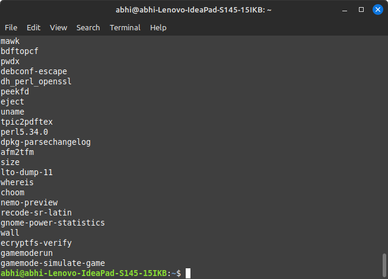
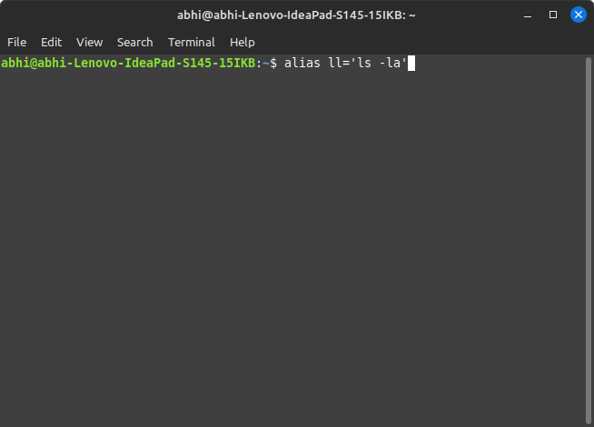
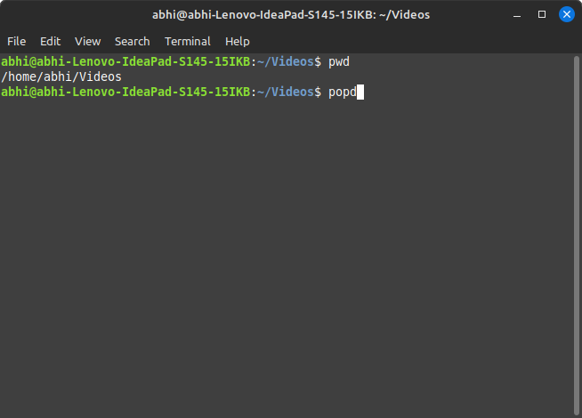

# Lab Assignment 1
## Getting Help

### To get manual page for the known command 
Command Name : man

Syntax : man [command]

Example : man ls


### To get manual page for the unknown command 
Command Name : apropos

Syntax : apropos [option] [keyword]

Example : apropos compress


### To know the source file binary 
Command Name : which

Syntax : which [command]

Example : which ls


### To know the path of the command 
Command Name : whereis

Syntax : whereis [options] [filename]

Example : whereis ls


### To know the command is external or internal
Command Name : type

Syntax : type [options] [command]

Example : type cd


### To get help for the internal command 
Command Name : help

Syntax : help [command]

Example : help cd


### To list out bash commands 
Command Name : compgen

Syntax : compgen -c

Example : compgen -c




### To know the usage of the command 
Command Name : man

Syntax : man [command_name]

Example : man ls


## Basic Commands 
### To know today’s date 
Command Name : date

Syntax : date

Example : date


### To print calendar
Command Name : cal

Syntax : cal [month] [year]

Example : cal 8 2024


### To print kernel version
Command Name : uname

Syntax : uname -r

Example : uname -r


### To print default shell
Command Name : echo

Syntax : echo $SHELL

Example : echo $SHELL


### To print currently logged in user 
Command Name : whoami

Syntax : whoami

Example : whoami


### To create shortcut for command 
Command Name : alias

Syntax : alias [name]=[command]

Example : alias ll='ls -la'




### To delete shortcut 
Command Name : unalias

Syntax : unalias [name]

Example : unalias ll


### To change the timestamp of the file
Command Name : touch

Syntax : touch [options] [filename]

Example : touch -t 202408021200 file.txt


### To clear the screen
Command Name : clear

Syntax : clear

Example : clear


### To create empty files 
Command Name : touch

Syntax : touch [filename]

Example : touch file1.txt file2.txt


### To know disk usage
Command Name : df

Syntax : df [options] [filename]

Example : df -h


### To know free space in the system
Command Name : df

Syntax : df [options] [filename]

Example : df -h


### To know about the Linux release
Command Name : lsb_release

Syntax : lsb_release -a

Example : lsb_release -a


### Navigation 
### To navigate home directory
Command Name : cd

Syntax : cd ~


### To navigate to the parent directory 
Command Name : cd

Syntax : cd ..


### To navigate to the child directory 
Command Name : cd

Syntax : cd [name]


### Alternate command to cd 
Command Name : pushd

Syntax : pushd [directoryname]


### To go back to the previous directory 
Command : popd

Syntax : popd




### To go to the root directory 
Command Name : cd

Syntax : cd /


## File System 
### How to identify the file system 
Command Name : df

Syntax : df -T


## Working with Folders
### Create Folder “CYS” 

### Navigate to CYS

### Create folder LS1 and LS2 under CYS

### Go back to CYS


## Working with Files 
### Add commands which you learnt during lab session in the file commands.txt

### Change the timestamp of the file to yesterday

### Copy the contents from the file commands.txt to commands_demo.txt

### Rename the file commands_demo.txt to duplicate

### Rename all .html to .hldd

### Delete the file duplicate

### Copy the contents commands.txt to unit4 and unit5 (using relative path)

### Delete the contents from unit5 (using absolute path)

### Navigate to root

### List all the files under root

### Explore all the folders (Do not delete any folder)

### Navigate to /etc/passwd

### Open the file passwd

### Explore the file  passwd

### Navigate to /etc/group and explore 

## Difference between 
### GUI vs. CLI

**`GUI (Graphical User Interface)`**: Provides a visual interface with windows, icons, and menus, allowing users to interact with the system through graphical elements and direct manipulation.

**`CLI (Command-Line Interface)`**: Allows interaction with the system through text-based commands entered into a terminal or command prompt, offering precise control and scripting capabilities.
### man vs info
**`man`**: Displays the manual pages for commands and programs, providing a detailed reference and usage information in a standardized format.

**`info`**: Shows documentation in a hypertext format, offering more extensive and organized information than `man`, often including tutorials and examples.

### which vs whereis

 **`which`**: Shows the path to the executable file for a command by searching directories listed in the PATH environment variable.

 **`whereis`**: Finds the binary, source, and manual page files for a command by searching standard directories and pre-configured paths.
### Terminal vs Shell
**`Terminal`**: A terminal is a program that provides a text-based interface to interact with the operating system. It emulates a physical terminal, allowing users to input commands and view output.

**`Shell`**: A shell is a command-line interpreter that processes commands entered by the user. It runs within the terminal, executing commands, running scripts, and managing the system environment.

## Write a simple shell script to print your name and your hobbies!
```bash
#!/bin/bash

echo "Name: Abhinav"
echo "Hobbies: Linux commands"
```
## Interesting commands to Explore 
### Banner 
### History 